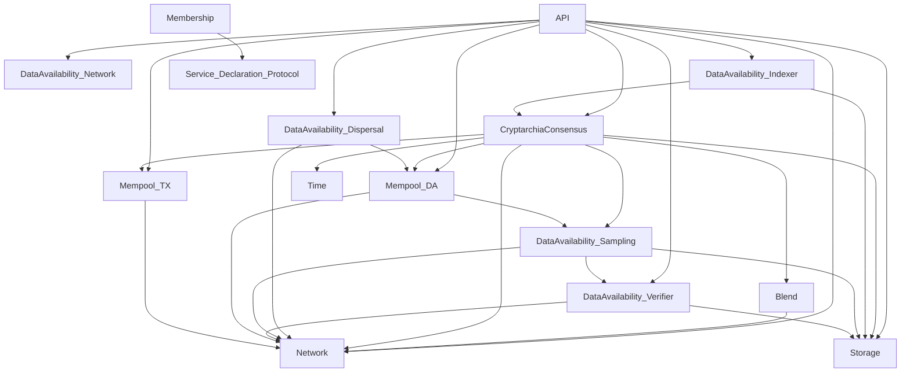

# 📦 Service Index

The following is a list of all [Overwatch](https://github.com/logos-co/Overwatch)-based Services within Nomos:

| Service Name                          | Crate                                        |
|---------------------------------------|----------------------------------------------|
| API                                   | `nomos-services/api`                         |
| Blend                                 | `nomos-services/blend`                       |
| CryptarchiaConsensus                  | `nomos-services/cryptarchia-consensus`       |
| DataAvailability - Dispersal          | `nomos-services/data-availability/dispersal` |
| DataAvailability - Indexer            | `nomos-services/data-availability/indexer`   |
| DataAvailability - Network            | `nomos-services/data-availability/network`   |
| DataAvailability - Sampling           | `nomos-services/data-availability/sampling`  |
| DataAvailability - Verifier           | `nomos-services/data-availability/verifier`  |
| Key Management System                 | `nomos-services/key-management-system`       |
| Membership                            | `nomos-services/membership`                  |
| Mempool - DA                          | `nomos-services/mempool`                     |
| Mempool - TX                          | `nomos-services/mempool`                     |
| Network                               | `nomos-services/network`                     |
| Service Declaration Protocol          | `nomos-services/sdp`                         |
| Storage                               | `nomos-services/storage`                     |
| System Sig                            | `nomos-services/system-sig`                  |
| Time                                  | `nomos-services/time`                        |
| Tracing                               | `nomos-services/tracing`                     |

# 🔍 Dependency Discovery Method

Dependencies between services were identified by searching for calls to `OverwatchHandle::relay` calls in the codebase
using the following (simplified) regular expression:
```regex
\.relay(::<.*>)?\(
```

### This matches patterns such as:
- `.relay()`
- `.relay::<TargetService>()`
- `.relay::<TargetService, _>()`

For best results, run with multiline matching enabled (e.g. `rg -U`).

# 🔗 Service Dependencies (Unidirectional)




<details>

<summary>Dependencies in TXT format.</summary>

```
API
├── Network
├── CryptarchiaConsensus
├── DataAvailability - Dispersal
├── DataAvailability - Network
├── DataAvailability - Indexer
├── DataAvailability - Verifier
├── Mempool - DA
├── Mempool - TX
└── Storage

Blend
└── Network

CryptarchiaConsensus
├── Network
├── Blend
├── Mempool - TX
├── Mempool - DA
├── DataAvailability - Sampling
├── Storage
└── Time

DataAvailability - Dispersal
├── Network
└── Mempool - DA

DataAvailability - Indexer
├── CryptarchiaConsensus
└── Storage

DataAvailability - Network
└── (no dependencies)

DataAvailability - Sampling
├── Network
├── Storage
└── DataAvailability - Verifier

DataAvailability - Verifier
├── Network
└── Storage

Key Management System
└── (no dependencies)

Membership
└── Service Declaration Protocol

Mempool - DA
├── Network
└── DataAvailability - Sampling

Mempool - TX
└── Network

Network
└── (no dependencies)

Service Declaration Protocol
└── (no dependencies)

Storage
└── (no dependencies)

System Sig
└── (no dependencies)

Time
└── (no dependencies)

Tracing
└── (no dependencies)
```

</details>